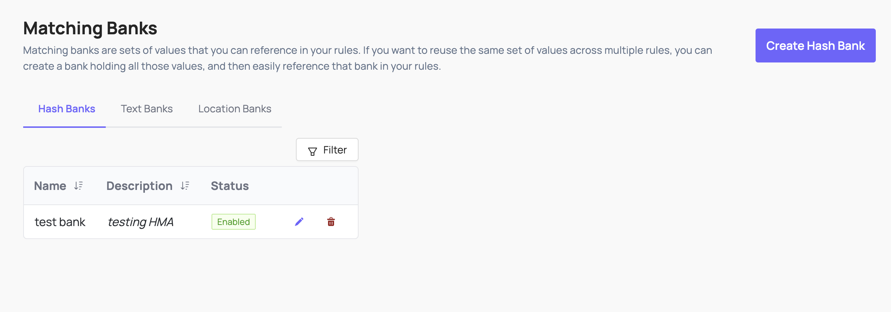
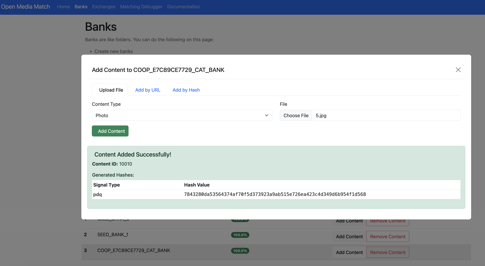

# Coop User Guide

The Coop UI has several pages accessible by a left-hand menu:

* Overview  
* Automated Enforcement  
* Policies  
* Review Console

As well as a bottom menu with buttons for logging out, managing settings, and viewing your profile.

## Dashboard

 

The Overview dashboard provides top level metrics for Coop that can be filtered by hourly or daily breakdown across a window of time including:

* Total actions taken   
* Jobs pending review  
* Automated vs manual actions  
* Top policy violations  
* Decisions per moderator  
* Actions per rule (if rules are enabled)  
* Count of violations by Policy

## Settings

### Configuring Items and Actions

 

Item Types represent the different types of entities on your platform. For example, if you've built a social network that allows users to create profiles, upload posts, and comment on other users' posts, then your Item Types might be **Profile**, **Post**, **Comment**, and **Comment Thread**. If you've built a marketplace platform, your Item Types might be **Buyer**, **Seller**, **Product Listing**, **Product Review,** **Direct Message**, **Transaction**, etc. Every Item you send Coop needs to be an instance of exactly one of these Item Types.

When creating an Item Type, define the schema to include which fields will be included and shown to reviewers. These fields are also available in any rule logic to connect with signals for routing or automation.

 

Actions represent any action you can perform on Items. Some common examples include Label, Send Warning, Delete, Ban, Mute, Send to Manual Review, Approve, etc. 

 

For every Action you define in Coop, you have to expose the action through an API endpoint that can receive requests from Coop. Whenever your rules determine that some Item should receive an Action, Coop will send a POST request to the Action's API endpoint. When your server receives that POST request, your code should actually perform the corresponding action.

 
Coop uses an API key to gate its endpoints. Use the UI to generate an API key to authenticate any requests Coop makes to your organization’s endpoints. 

### Integrations
 
Coop comes with pre-built integrations to common software used for online safety. Add your API key to enable integrations like OpenAI’s Moderation API or Google’s Content Safety API, and set up your instance of Meta’s Hasher-Matcher-Actioner.

### User Management
 

Coop uses role-based access controls to make sure the right people can access and view the right data. You can use the UI to invite more users and either copy the link for them to sign up with an account, or set up an email service to email the link to the invited user.   

### User Roles

Coop comes with 7 predefined roles that can be further customized:

| User Role | Access Manual Review Tool | View all Queues | Create, Delete and Edit Queues | Create, Delete and Edit Rules | Access NCMEC data  | Access Insights |
| :---- | :---- | :---- | :---- | :---- | :---- | :---- |
| Admin | Yes | Yes | Yes | Yes | Yes | Yes |
| Moderator Manager | Yes | Yes | Yes | No | Yes | Yes |
| Analyst/Rules Manager | No | Yes | No | Yes | No | Yes |
| Child Safety Moderator | Yes | No | No | No | Yes | No |
| Moderator | Yes | No | No | No | No | No |
| External Moderator | Yes | No | No | No | No | No |

**Admin**  
Admins manage their entire organizations. They have full control over all of the organization's resources and settings within Coop.

**Analyst**  
Analysts can view metrics for all Rules, create or edit Draft and Background Rules, and run Backtests. They cannot create or edit Live Rules, run Retroaction on Live rules, or edit any other resources (Actions, Content Types, Signals, other Users, etc.). In short, they can experiment with Background Rules and view Rule metrics, but cannot affect any Live Rules or other features that actually mutate your data.

**Child Safety Moderator**  
Child Safety Moderators have the same permissions as Moderators, but they are also able to review Child Safety jobs and can see previous Child Safety decisions.

**External Moderator**  
External Moderators can only review jobs in the Manual Review tool. They cannot see any decisions or use any other tooling

**Moderator**  
Moderators can view the Manual Review tool, but are only able to review jobs from queues that they've been given permission to see. They can also view overall Manual Review metrics. They cannot see any Child Safety-related jobs or decisions.

**Moderator Manager**  
Moderator managers can view and edit queues within the Manual Review Tool. They have full control over the permissions that moderators have, and the Routing Rules that determine how to route each incoming job to the right queue.

**Rules Manager**  
Rules Managers can create, edit, and deploy Rules, and they can view all metrics related to Rules. They cannot create, edit, or delete other organization-level settings, including Actions, Item Types, Manual Review Queues, or other Users in the organization.

Once you invite a new user to Coop, you can either configure an email service to send the link to that person or copy the invite link and share it directly with them.

### SSO

Learn how to configure SSO using Okta SAML.

Coop only supports SSO through Okta SAML.

**Prerequisites**

To configure Okta SAML SSO, you must:

* Be in Admin mode in Okta.
* Have group names that match exactly between Okta and SAML.
* Have admin permissions in Coop.
* Have the ability to create a custom SAML application.

**Configuration**

1. Create a [custom SAML application](https://help.okta.com/oag/en-us/content/topics/access-gateway/add-app-saml-pass-thru-add-okta.htm) in Okta. Use the following settings.

   | Setting | Value |
   | :------ | :---- |
   | Single sign-on URL | Your organization's callback URL (e.g. `https://your-coop-instance.com/login/saml/12345/callback`). You can find your callback link in Coop under **Settings → SSO**. |
   | Audience URI (SP Entity ID) | Your Coop instance base URL (e.g. `https://your-coop-instance.com`). |
   | `email` attribute (in **Attribute Statements**) | `email`. This field depends on your Identity Provider's attribute mappings (e.g. Google SSO may use "Primary Email"). |

2. In the **Feedback** tab, check **I'm a software vendor. I'd like to integrate my app with Okta**.
3. In your app's settings, go to the **Sign On** tab. Under **SAML Signing Certificates → SHA-2**, click **Actions → View IdP metadata**.
4. Copy the contents of the XML file. In Coop, go to **Settings → SSO** and paste the XML into the **Identity Provider Metadata** field.
5. On the same page, enter `email` in the **Attributes** section.
6. In your Okta app under **Assignments**, assign users or groups to your app.

### Wellness and Safety

Reviewer safety and well-being is critical. Trust & Safety is an incredibly difficult field of work, and it can take a severe mental toll, especially for the moderators who are on the front line, reviewing disturbing content for hours on end every day.

That's why Coop includes customizable settings to prioritize reviewer safety. These come in two forms:
 

1. **Company-wide Safety Settings:** If you are an Admin in your platform’s Coop organization, you can set the default safety settings for every employee at your company who has their own login credentials. Those are configured in your Employee Safety settings page.  

 

2. **Personal Safety Settings:** Any user can customize their own personal safety settings in their account settings page. These will override the default, company-wide safety settings and allow users to create the best experience for themselves.

For both levels of safety settings, you can customize the following properties:

1. **Image & video blur strength:** you can configure whether images and videos are always blurred by default, along with the strength of the blur. When images are blurred within Coop, hovering over the image with your mouse will unblur the image, and moving your mouse outside the image will blur it again. When videos are blurred within Coop, playing the video will unblur it.  
2. **Image & video grayscale:** you can decide whether images and videos are displayed in grayscale or in full color.  
3. **Video muted by default:** you can ensure videos are always muted by default, even if your device's volume is on.

## Policies
 
Policies are categories of harm that are prohibited or monitored on your platform. Some typical examples include Spam, Nudity, Fraud, Violence, etc. Policies can have sub-policies underneath them, so the Spam policy could have sub-policies like Commercial Spam, Repetitive Content, Fake Engagement, Scams and Phishing, etc., all of which are specific types of Spam that could occur on your platform.

It is often useful (and in some cases, required by some legislation) to tie every Action you take to one or more specific Policies. For example, you could Delete a comment under your Nudity policy, or you could Delete it under your Spam policy. Coop allows you to track those differences and measure how many Actions you've taken for each Policy. That way, you can see how effectively you're enforcing each Policy over time, identify Policies for which your enforcement is poor or degrading, and report performance metrics to your team (or to regulators).

Policies added in Coop’s UI will be visible to reviewers directly in the review flow, so they can easily reference policies and enforcement guidelines.

Learn more about Policies from the [Trust & Safety Professional Association.](https://www.tspa.org/curriculum/ts-fundamentals/policy/policy-development/)

## Manual Review

### Queues
 

Coop uses [Queues](https://en.wikipedia.org/wiki/Queue_\(abstract_data_type\)) (i.e. ordered containers) to organize tasks. When you create a task in Coop, the task will enter a Queue and wait to be reviewed. Then, when a user visits the Queue dashboard and clicks "Start Reviewing" on a particular Queue, Coop pulls the oldest task in the Queue so the user can review it. After a user makes a decision on a task, they will automatically see the next oldest task until the Queue is empty or the user stops. Coop will automatically make sure that two moderators won't receive the same job to avoid duplicate work.  

Queues can be starred to prioritize at the top of the review console (per user) and show the number of pending jobs.

You may want to restrict which Actions can be triggered from a particular Queue. When you create or edit a Queue, you can configure which Actions are hidden for that Queue through its "Hidden Actions" setting.

### Task View

The task (aka Job) view, shows information about the flagged content or actor being reviewed. Each task has its own hyperlink and can be shared across anyone at your organization who is allowed to access Coop.   
When a user reviews a task, Coop will show as much relevant information about the task and its corresponding Item as possible. As a baseline, the Item's fields will render, and depending on the Item's type (e.g. whether it's a DM, Comment, Profile, etc.), Coop will try to render additional relevant information and surrounding context, including:

* Associated user account connected to the content  
* Additional content associated with the same user

Default actions include:

* Ignore (task is closed with no action taken)  
* Enqueue to NCMEC (moves the task to the NCMEC review queue and converts it into a User type review, aggregating all media associated with the user)  
* Move (moves the task to another existing queue)

Any Actions you configure will also show up. You can hide specific actions in specific queues when creating or editing a queue. 

## Investigation

 
You can use the Investigation tool (either plug in the unique ID of the Item or click through from a manual review task) to see more information about it:

* The Item itself, including all relevant attributes and metadata Coop has on that Item.  
* The user who created the Item (if applicable), and all the attributes and metadata Coop has on the user.  
* The details and full context of any previous actions taken on the Item, and the user who created it.  
* Other Items that are closely related to the main Item you're investigating. For example, if you're investigating a single comment within a larger comment thread, we'll show you preceding and subsequent comments in the thread.

You can also manually take action on the Item as you're investigating it. This is useful when you want to take action but aren't reviewing the Item within the context of a Review Queue.

## Automated Enforcement

Read more about rules in Coop in the [rules doc](RULES.md#automated-action-rules).

### Matching Banks
 

A Matching Bank is a way to keep track of a large list of values that you'd want to check for matches. For example, you could create a Matching Bank that holds 10,000 keywords, and you can check every new post or comment to see if the text in the post or comment matches any of the 10,000 banned keywords in the Matching Bank. You can build Rules that reference your Matching Banks, so you don't have to list out all 10,000 banned keywords every time you create a Rule that checks for matches against those keywords.

You can also use regex in rules, for example a regex checking if a URL has been shortened:  
 
These banks can then be used as signals in both automatic enforcement rules and routing rules for manual review.  

#### Hash Banks
Coop integrates with [hasher-matcher-actioner (HMA)](https://github.com/facebook/ThreatExchange/tree/main/hasher-matcher-actioner/), providing a configurable way to match known CSAM, non-consensual intimate imagery, terrorist and violent extremist content, and any internal hash banks you maintain. Setup requires API credentials from supported hash databases like NCMEC and StopNCII. Read more about HMA documentation [here]([https://github.com/facebook/ThreatExchange/tree/main/hasher-matcher-actioner](https://github.com/facebook/ThreatExchange/tree/main/hasher-matcher-actioner/docs)).

HMA signals are available as a signal in Coop’s signal library.

##### Setting Up HMA
How you set things up depends on your use case:

* If items are submitted by user reports (`POST /api/v1/report`): no enforcement rule is needed. Reported items are automatically enqueued to MRT, and routing rules will direct them to the right queue. Simply create a routing rule with the image hash condition and your target queue.

* If items are submitted via the items API `(POST /api/v1/items/async/)` and you want Coop to proactively flag matches without a user report: you need an automated enforcement rule with the image hash condition and a "Send to Manual Review" action. Optionally pair it with a routing rule to direct matches to a specific queue (otherwise they go to the default queue).

##### Managing hash banks

Banks created directly in HMA (e.g. via the HMA UI or seed scripts) will not appear in Coop's Matching Banks UI unless they are also registered in the hash_banks table. The recommended approach is to create banks through the Coop UI (Settings → Matching Banks), which registers the bank in both HMA and Coop's database automatically.

 

Banks created through Coop are named in HMA using the convention COOP_<ORGID>_<NORMALIZED_NAME> — for example, a bank named "Test Bank" for org e7c89ce7729 becomes `COOP_E7C89CE7729_TEST_BANK` in HMA. This is what you will see in the HMA UI. You can use the HMA UI to manually add content to the bank for local testing.

 

#### Location Banks
 

A Location Matching Bank holds a list of [geohashes](https://en.wikipedia.org/wiki/Geohash) or [Google Maps Places](https://developers.google.com/maps/documentation/places/web-service), which are two types of references to geographical locations. This can be helpful if you have a list of locations where you want to apply a different set of Rules. For example, you can apply stricter sexual content Rules on college and high school campuses than you do elsewhere.

## Appeals
 
When you make a decision that affects a user on your platform, you may want to give them the ability to "appeal" your decision (and the EU's [Digital Services Act](https://eur-lex.europa.eu/legal-content/en/TXT/?uri=COM%3A2020%3A825%3AFIN) requires this for many platforms). If a user appeals a moderation decision, you'll send that Appeal to Coop's Appeal API so that a moderator can review the Appeal and decide whether or not to overturn the original decision. 

 

Reports and appeals can be closely related. For example:

* User A can report User B's profile, which you would send to Coop through the Report API.  
* If a moderator suspend's User B, then User B may appeal that suspension decision, which you would send to Coop through the Appeal API.  
* A different moderator can then accept the Appeal and overturn the suspension, or they can reject the Appeal and sustain the suspension.

## Recent Decision Log

Coop logs all actions taken in a Recent Decisions Log that includes basic information like the decision(s) taken on each Job and the user who made the decision.

 
 You can also see the full Job itself if you decide you want to investigate further, take additional Actions, or overturn a previous Decision.

## NCMEC Review and Reporting

Coop is integrated with the [CyberTip Reporting API](https://report.cybertip.org/ispws/documentation) from the National Center for Missing and Exploited Children. In order to review accounts and content to report to NCMEC, you must have:

1. A manual review queue called “NCMEC Review”  
2. A User item type that is a RELATED_ITEM field for associated content. This stores a structured reference to the User item. NCMEC-type jobs extract the user identifier from this structured reference to look up the full user in the Item Investigation Service.  
   1. Coop will automatically convert content Item Types and aggregate all media associated with the user to convert the job into a NCMEC-type job. This creates a detailed NCMEC report around one user, rather than multiple NCMEC reports for multiple pieces of content from the same user.

 
The NCMEC job UI includes:

* Incident Type category (from the [Reporting API](https://report.cybertip.org/ispws/documentation/index.html#incident-summary)). Values include:  
  * Child Pornography (possession, manufacture, and distribution)  
  * Child Sex Trafficking  
  * Child Sex Tourism  
  * Child Sexual Molestation  
  * Misleading Domain Name  
  * Misleading Words or Digital Images on the Internet  
  * Online Enticement of Children for Sexual Acts  
  * Unsolicited Obscene Material Sent to a Child  
* [Industry categorization](https://report.cybertip.org/ispws/documentation/index.html#incident-summary) (A categorization from the ESP-designated categorization scale):  
  * A1  
  * A2  
  * B1  
  * B2  
* [Labels (file annotations)](https://report.cybertip.org/ispws/documentation/index.html#file-annotations):  
  * **animeDrawingVirtualHentai**: The file is depicting anime, drawing, cartoon, virtual or hentai.  
  * **potentialMeme**: The file is being shared/posted out of mimicry or other seemingly non-malicious intent.  
  * **viral:** The file is circulating rapidly from one user to another.  
  * **possibleSelfProduction**: The file contains content that is believed to be self-produced.  
  * **physicalHarm**: The file depicts an intentional act of causing physical injury or trauma to a person.  
  * **violenceGore**: The file depicts graphic violence, including but not limited to acts of brutality or detailed or vivid gruesomeness.  
  * **bestiality**: The file involves an animal.  
  * **liveStreaming**: The file depicts content that was streamed live at the time it was uploaded.  
  * **infant**: The file depicts an infant.  
  * **generativeAi**: The file contains content that is believed to be Generative Artificial Intelligence.
